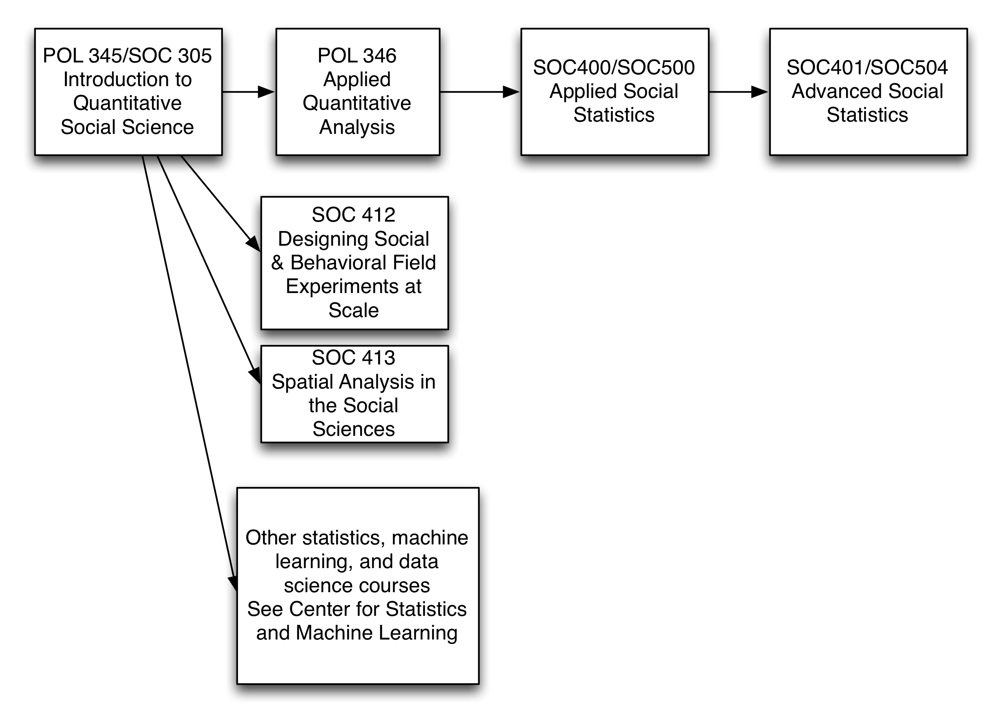
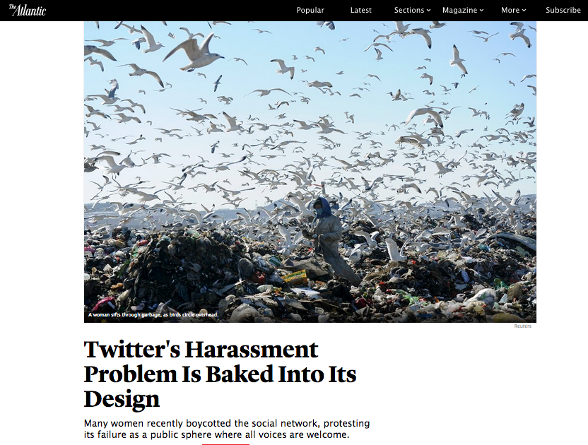
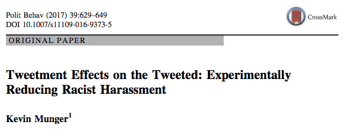
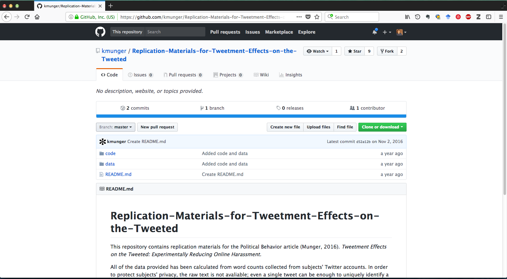
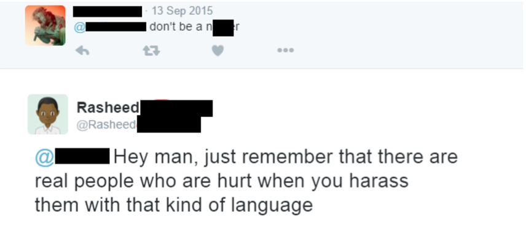
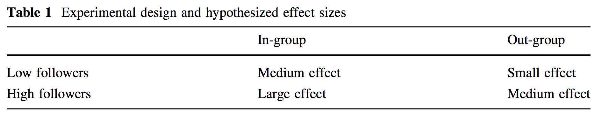
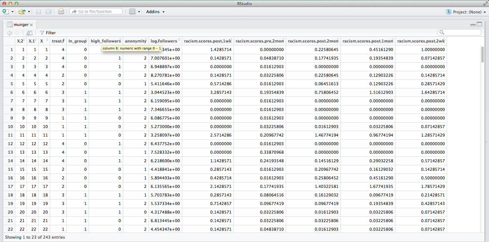
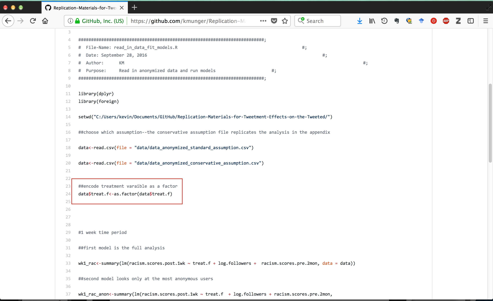
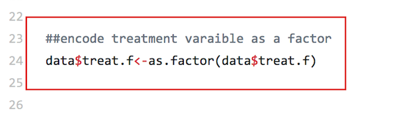

```{r setup, include=FALSE}
knitr::opts_chunk$set(echo = FALSE)
library(viridis)
```

## Your future courses

\begin{center}
Omar Wasow from POL 346 Applied Quantitative Analysis
\end{center}

## Your future courses




## Logistics

* QSS assignments due 24 hours before precept 
* Pset 3 will be posted W 12/6 and due W 12/13
* COMPASS workshop: Thurs, 11/30 Text Mining in R (Ethan)

## Goals for today

* See real data analyis workflow (with data wrangling)
* Review difference-of-means 
* Show connection between difference-of-means and regression
* Explore multiple regression with continuous and dummy variables in equations, code, pictures, and words
* Learn something about Twitter

## 



\vfill
https://www.theatlantic.com/technology/archive/2017/10/twitters-harassment-problem-is-baked-into-its-design/542952/

##



\vfill
http://dx.doi.org/10.1007/s11109-016-9373-5

##



\vfill
https://github.com/kmunger/Replication-Materials-for-Tweetment-Effects-on-the-Tweeted

## 


\vfill
See paper for more on the sampling procedure

##



##


## 



\vfill
2 x 2 design

##

Why do we need an experiment?

## 

```{r, echo = TRUE}
munger <- read.csv("data/munger_tweetment_2017_data.csv")
summary(munger)
```

## 



## Data wrangling

```{r, echo = TRUE}
barplot(table(munger$treat.f))
```

## Data wrangling

```{r, echo = TRUE}
str(munger$treat.f)
```

## Data wrangling



## Data wrangling



## Data wrangling

```{r, echo = TRUE}
munger$treat.f <- as.factor(munger$treat.f)
# 0 = control
# 1 = in-group, low followers
# 2 = out-group, low followers
# 3 = in-group, high followers
# 4 = out-group, high followers
levels(munger$treat.f) <- c("control", 
                            "in-group/low",
                            "out-group/low",
                            "in-group/high",
                            "out-group/high")
```

## Data wrangling

```{r, echo = TRUE}
barplot(table(munger$treat.f))
```

## Data wrangling

Why am I not adding more informative labels?

## Data wrangling

```{r}
hist(munger$racism.scores.post.1wk)
```

## Data wrangling

"Each panel shows the results of an OLS regression in which the dependent variable is the absolute number of instances of racists language during that period divided by the number of days in that time period."

## Data wrangling

```{r}
barplot(table(munger$racism.scores.post.1wk * 7))
```

## Data wrangling

```{r}
boxplot(racism.scores.post.1wk ~ treat.f, 
        data = munger)
```

## Data wrangling

```{r, echo=TRUE}
munger.twogroup <- subset(munger, subset = treat.f %in% c("control", "in-group/high"))
dim(munger.twogroup)
```

## Data wrangling

```{r}
plot(density(munger[munger$treat.f == "in-group/high", "racism.scores.post.1wk"]), 
     col = "blue", 
     lty = 1,
     main = "Comparing outcome for treatment and control group",
     xlab = "Racism, 1 week post-treatment")
lines(density(munger[munger$treat.f == "control", "racism.scores.post.1wk"]),
      col = "red", 
      lty = 2)
legend(2, 4.5, legend = c("in-group/high", "control"),
       col = c("blue", "red"), lty = 1:2, cex = 0.8)
```

## Intermission

What to make great plots without all the fiddling?  Try ggplot2 at the 
COMPASS Workshop on December 7. \pause Can't wait that long? \pause


##

```{r}
plot(density(munger[munger$treat.f == "in-group/high", "racism.scores.post.1wk"]), 
     col = "blue", 
     lty = 1,
     main = "Comparing outcome for treatment and control group",
     xlab = "Racism, 1 week post-treatment")
lines(density(munger[munger$treat.f == "control", "racism.scores.post.1wk"]),
      col = "red", 
      lty = 2)
legend(2, 4.5, legend = c("in-group/high", "control"),
       col = c("blue", "red"), lty = 1:2, cex = 0.8)
```

## Difference-of-means approach

```{r, echo = TRUE}
y.treat <- mean(munger[munger$treat.f == "in-group/high", "racism.scores.post.1wk"])
y.control <- mean(munger[munger$treat.f == "control", "racism.scores.post.1wk"])
est.ate <- y.treat - y.control
print(paste("y.treat:", y.treat))
print(paste("y.control:", y.control))
print(paste("est.ate:", est.ate))
```

The treated group created about 0.5 fewer racists post per day.

## Difference-of-means approach

```{r echo = TRUE}
n.treat <- sum(munger$treat.f == "in-group/high")
n.control <- sum(munger$treat.f == "control")
est.var.treat <- var(munger[munger$treat.f == "in-group/high", "racism.scores.post.1wk"]) / n.treat
est.var.control <- var(munger[munger$treat.f == "control", "racism.scores.post.1wk"]) / n.control
est.se.ate <- sqrt(est.var.treat + est.var.control)

print(paste("est.se.ate:", est.se.ate))
```

## Difference-of-means approach

```{r, echo = TRUE}
# 95% interval, rather than 1.96 you could use qnorm(0.975), see Imai Table 7.1 for other values
lower.ci.95 <- est.ate - 1.96 * est.se.ate
upper.ci.95 <- est.ate + 1.96 * est.se.ate

print("Estimated 95 percent confidence interval:")
print(c(lower.ci.95, upper.ci.95))
```

## Regression approach

Let's try that again with regression

## Regression approach, data wrangling

```{r, echo = TRUE}
munger.subset <- subset(munger, 
                        subset = treat.f %in% 
                          c("control", "in-group/high"))
munger.subset$treat.n <- NA
cases.ih <- munger.subset$treat.f == "in-group/high"
munger.subset[cases.ih, "treat.n"] <- 1
cases.c <- munger.subset$treat.f == "control"
munger.subset[cases.c, "treat.n"] <- 0
```

## Regression approach

```{r}
plot(munger.subset$treat.n, munger.subset$racism.scores.post.1wk)
```

## Regression approach

```{r}
plot(munger.subset$treat.n, munger.subset$racism.scores.post.1wk, 
     ylab = "Racist tweets per day",
     xaxt = "n",
     xlim = c(-0.5, 1.5), 
     xlab = "")
axis(side = 1, at = c(0, 1), labels = c("Control", "Treatment"))
# For more, see: https://www.statmethods.net/advgraphs/axes.html
```

## Regression approach

```{r}
plot(munger.subset$treat.n, munger.subset$racism.scores.post.1wk, 
     ylab = "Racist tweets per day",
     xaxt = "n",
     xlim = c(-0.5, 1.5), 
     xlab = "")
axis(side = 1, at = c(0, 1), labels = c("Control", "Treatment"))
fit <- lm(racism.scores.post.1wk ~ treat.n,
          data = munger.subset)
abline(fit)
```

## 

```{r, echo=TRUE}
fit <- lm(racism.scores.post.1wk ~ treat.n,
          data = munger.subset)
```

$\hat{y}_i = \hat{\beta}_0 + \hat{\beta}_1 x_i$
where

* $\hat{y}_i$ racist tweets per day
* $x_i$ 1 if treatment, 0 if control

##

```{r, echo=FALSE}
print(fit)
print(paste("y.treat:", y.treat))
print(paste("y.control:", y.control))
```

##

The difference-of-means and the regression approach give us the same answer.^[Technical note for interested folks: they can give slightly different estimated standard errors http://dx.doi.org/10.1016/j.spl.2011.10.024] So why should we care about the regression approach? \pause

It generalizes in interesting ways. \pause

* adjusting for pre-treament information
* studying multiple treatments at the same time

## Adjusting for pre-treatment information

Being racist in the past predicts being racist in the future

```{r}
par(pty = "s")
plot(x = munger[munger$treat.f == "control", "racism.scores.pre.2mon"],
     y = munger[munger$treat.f == "control", "racism.scores.post.1wk"], 
     xlim = c(0, 5), 
     ylim = c(0, 5),
     xlab = "Racism before", 
     ylab = "Racism after",
     main = "Control cases only")
```

##

```{r}
plot(munger.subset$treat.n, munger.subset$racism.scores.pre.2mon, 
     ylab = "Racist tweets per day (pre-treatment)",
     xaxt = "n",
     xlim = c(-0.5, 1.5), 
     xlab = "")
axis(side = 1, at = c(0, 1), labels = c("Control", "Treatment"))
fit <- lm(racism.scores.post.1wk ~ treat.n,
          data = munger.subset)
```

##

```{r}
plot(jitter(munger.subset$treat.n), jitter(munger.subset$racism.scores.pre.2mon), 
     ylab = "Racist tweets per day (pre-treatment)",
     xaxt = "n",
     xlim = c(-0.5, 1.5), 
     xlab = "")
axis(side = 1, at = c(0, 1), labels = c("Control", "Treatment"))
fit <- lm(racism.scores.post.1wk ~ treat.n,
          data = munger.subset)
```

## 

For more on including pre-treatment in the analysis of online field experiments:

* http://www.bitbybitbook.com/en/running-experiments/beyond-simple/
* http://www.bitbybitbook.com/en/running-experiments/exp-advice/3rs/


## 

```{r}
munger.subset$treat.f <- droplevels(munger.subset$treat.f)
plot(munger.subset$racism.scores.pre.2mon, 
     munger.subset$racism.scores.post.1wk, 
     col = c("red", "blue")[munger.subset$treat.f],
     xlab = "Racism, pre-treatment", 
     ylab = "Racism, post-treatment")
# for more on colors, see https://stackoverflow.com/questions/7466023/how-to-give-color-to-each-class-in-scatter-plot-in-r

legend(0, 4.9, legend = c("control", "treatment"),
       col = c("blue", "red"), lty = 1, cex = 0.8)


fit <- lm(racism.scores.post.1wk ~ racism.scores.pre.2mon + treat.n,
          data = munger.subset)
abline(a = coef(fit)["treat.n"] + coef(fit)["(Intercept)"],
       b = coef(fit)["racism.scores.pre.2mon"], col = "blue")
abline(a = coef(fit)["(Intercept)"],
       b = coef(fit)["racism.scores.pre.2mon"], col = "red")
```


## 

```{r, echo = TRUE}
fit1 <- lm(racism.scores.post.1wk ~ 
             racism.scores.pre.2mon + treat.n,
           data = munger.subset)
```

$\hat{y}_i = \hat{\beta}_0 + \hat{\beta}_1 x_{i,1} + \hat{\beta}_2 x_{i,2}$
where

* $\hat{y}_i$ racist tweets per day, post-treatment
* $x_{i,1}$ racist tweets per day, pre-treatment
* $x_{i,2}$ 1 if treatment, 0 if control

## 

```{r echo=FALSE}
# Based on https://stackoverflow.com/questions/26372138/beamer-presentation-rstudio-change-font-size-for-chunk
knitr::knit_hooks$set(mysize = function(before, options, envir) {
  if (before) 
    return(options$size)
})
```

```{r, echo = TRUE, mysize=TRUE, size='\\scriptsize'} 
lm(racism.scores.post.1wk ~ racism.scores.pre.2mon + treat.n,
           data = munger.subset)
```

## 

```{r, echo = TRUE}
lm(racism.scores.post.1wk ~ treat.n,
          data = munger.subset)
```

## 

* adjusting for pre-treament information
* studying multiple treatments at the same time

## Studying multiple treatments at the same time, data wrangling

Creating dummy variable
```{r, echo = TRUE}
munger$control <- ifelse(munger$treat.f == "control",
                         1, 0)
munger$in.low <- ifelse(munger$treat.f == "in-group/low",
                         1, 0)
munger$out.low <- ifelse(munger$treat.f == "out-group/low",
                         1, 0)
munger$in.high <- ifelse(munger$treat.f == "in-group/high",
                         1, 0)
munger$out.high <- ifelse(munger$treat.f == "out-group/high",
                         1, 0)
```

## Studying multiple treatments at the same time, data wrangling

```{r echo=FALSE}
# Based on https://stackoverflow.com/questions/26372138/beamer-presentation-rstudio-change-font-size-for-chunk
knitr::knit_hooks$set(mysize = function(before, options, envir) {
  if (before) 
    return(options$size)
})
```

```{r, echo = TRUE, mysize=TRUE, size='\\scriptsize'} 
head(munger[, 
            c("treat.f", "control", "in.low", "out.low", "in.high", "out.high")], 
     n = 10)
```

## Studying multiple treatments at the same time

```{r, echo = TRUE} 
lm(racism.scores.post.1wk ~ racism.scores.pre.2mon +
    in.low + out.low + in.high + out.high + control,
   data = munger)
```


## Why did this fail?

Broken model:

$\hat{y}_i = \hat{\beta}_0 + \hat{\beta}_1 racist\_pre_{i} + \hat{\beta}_2 in\_low_i + \hat{\beta}_3 out\_low_{i} + \hat{\beta}_4 in\_high_{i} + \hat{\beta}_5 out\_high_{i} + \hat{\beta}_6 control_{i}$

\pause

Better model:

$\hat{y}_i = \hat{\beta}_0 + \hat{\beta}_1 racist\_pre_{i} + \hat{\beta}_2 in\_low_i + \hat{\beta}_3 out\_low_{i} + \hat{\beta}_4 in\_high_{i} + \hat{\beta}_5 out\_high_{i}$

\pause

* Deeper explaination: Take Prof. Wasow's class
* Can't wait: http://www.algosome.com/articles/dummy-variable-trap-regression.html

##

```{r, echo = TRUE} 
lm(racism.scores.post.1wk ~ racism.scores.pre.2mon +
    in.low + out.low + in.high + out.high,
   data = munger)
```

## 


## 

```{r}
library(viridis)
plot(munger$racism.scores.pre.2mon, 
     munger$racism.scores.post.1wk,
     col = viridis(n = 5)[munger$treat.f],
     xlab = "Racism, pre-treatment", 
     ylab = "Racism, post-treatment")
# for more on colors, see https://stackoverflow.com/questions/7466023/how-to-give-color-to-each-class-in-scatter-plot-in-r
```

##

Better model:

$\hat{y}_i = \hat{\beta}_0 + \hat{\beta}_1 racist\_pre_{i} + \hat{\beta}_2 in\_low_i + \hat{\beta}_3 out\_low_{i} + \hat{\beta}_4 in\_high_{i} + \hat{\beta}_5 out\_high_{i}$


## 

```{r}
library(viridis)
plot(munger$racism.scores.pre.2mon, 
     munger$racism.scores.post.1wk,
     col = viridis(n = 5)[munger$treat.f],
     xlab = "Racism, pre-treatment", 
     ylab = "Racism, post-treatment")
# for more on colors, see https://stackoverflow.com/questions/7466023/how-to-give-color-to-each-class-in-scatter-plot-in-r


fit <- lm(racism.scores.post.1wk ~ racism.scores.pre.2mon + in.low + out.low + in.high + out.high, data = munger)

# should have a way to automatically map lines to colors, would be easy with ggplot2, will do manually
color.vec <- viridis(n = 5)[munger$treat.f]
control.col <- color.vec[min(which(munger$treat.f == "control"))]
in.high.col <- color.vec[min(which(munger$treat.f == "in-group/high"))]
in.low.col <- color.vec[min(which(munger$treat.f == "in-group/low"))]
out.low.col <- color.vec[min(which(munger$treat.f == "out-group/low"))]
out.high.col <- color.vec[min(which(munger$treat.f == "out-group/high"))]

abline(a = coef(fit)["(Intercept)"],
       b = coef(fit)["racism.scores.pre.2mon"], 
       col = control.col)
abline(a = coef(fit)["(Intercept)"] + coef(fit)["in.low"],
       b = coef(fit)["racism.scores.pre.2mon"], 
       col = in.low.col)
abline(a = coef(fit)["(Intercept)"] + coef(fit)["out.low"],
       b = coef(fit)["racism.scores.pre.2mon"], 
       col = out.low.col)
abline(a = coef(fit)["(Intercept)"] + coef(fit)["in.high"],
       b = coef(fit)["racism.scores.pre.2mon"], 
       col = in.high.col)
abline(a = coef(fit)["(Intercept)"] + coef(fit)["out.high"],
       b = coef(fit)["racism.scores.pre.2mon"], 
       col = out.high.col)

legend(0, 4.9, 
       legend = c("control", "in.low", "out.low", "in.high", "out.high.col"),
       col = c(control.col, in.low.col, out.low.col, in.high.col, out.high.col),
       lty = 1, cex = 0.8)
```

## Your turn

```{r echo=FALSE}
# Based on https://stackoverflow.com/questions/26372138/beamer-presentation-rstudio-change-font-size-for-chunk
knitr::knit_hooks$set(mysize = function(before, options, envir) {
  if (before) 
    return(options$size)
})
```

```{r, echo = FALSE, mysize=TRUE, size='\\tiny'}
lm(racism.scores.post.1wk ~ racism.scores.pre.2mon + in.low + out.low + in.high + out.high, data = munger)
```

Which treatment is estimated to be the *most* effective?

1. in-group/low status
2. out-group/low status
3. in-group/high status
4. out-group/high status

\pause
Answer: 3. in-group/high status

## Your turn

```{r echo=FALSE}
# Based on https://stackoverflow.com/questions/26372138/beamer-presentation-rstudio-change-font-size-for-chunk
knitr::knit_hooks$set(mysize = function(before, options, envir) {
  if (before) 
    return(options$size)
})
```

```{r, echo = FALSE, mysize=TRUE, size='\\tiny'}
lm(racism.scores.post.1wk ~ racism.scores.pre.2mon + in.low + out.low + in.high + out.high, data = munger)
```

Which treatment is estimated to be the least effective?

1. in-group/low status
2. out-group/low status
3. in-group/high status
4. out-group/high status

\pause
Answer: 2. out-group/low status

## 


## 


\vfill
https://www.theatlantic.com/technology/archive/2017/10/twitters-harassment-problem-is-baked-into-its-design/542952/

## 


\vfill
http://dx.doi.org/10.1007/s11109-016-9373-5

##


\vfill
https://github.com/kmunger/Replication-Materials-for-Tweetment-Effects-on-the-Tweeted}


## 

Kevin Munger's next project: Experimentally Reducing Partisan
Incivility on Twitter

* paper: http://kmunger.github.io/pdfs/jmp.pdf
* slides from talk at Twitter: http://kmunger.github.io/pdfs/munger_twitter_8_31.pdf


## Goals for today

* See real data analyis workflow (with data wrangling)
* Review difference-of-means 
* Show connection between difference-of-means and regression
* Explore multiple regression with continuous and dummy variables in equations, code, pictures, and words
* Learn something about Twitter

## But there are open questions

```{r, fig.height = 4}
library(viridis)
plot(munger$racism.scores.pre.2mon, 
     munger$racism.scores.post.1wk,
     col = viridis(n = 5)[munger$treat.f],
     xlab = "Racism, pre-treatment", 
     ylab = "Racism, post-treatment")
# for more on colors, see https://stackoverflow.com/questions/7466023/how-to-give-color-to-each-class-in-scatter-plot-in-r


fit <- lm(racism.scores.post.1wk ~ racism.scores.pre.2mon + in.low + out.low + in.high + out.high, data = munger)

# should have a way to automatically map lines to colors, would be easy with ggplot2, will do manually
color.vec <- viridis(n = 5)[munger$treat.f]
control.col <- color.vec[min(which(munger$treat.f == "control"))]
in.high.col <- color.vec[min(which(munger$treat.f == "in-group/high"))]
in.low.col <- color.vec[min(which(munger$treat.f == "in-group/low"))]
out.low.col <- color.vec[min(which(munger$treat.f == "out-group/low"))]
out.high.col <- color.vec[min(which(munger$treat.f == "out-group/high"))]

abline(a = coef(fit)["(Intercept)"],
       b = coef(fit)["racism.scores.pre.2mon"], 
       col = control.col)
abline(a = coef(fit)["(Intercept)"] + coef(fit)["in.low"],
       b = coef(fit)["racism.scores.pre.2mon"], 
       col = in.low.col)
abline(a = coef(fit)["(Intercept)"] + coef(fit)["out.low"],
       b = coef(fit)["racism.scores.pre.2mon"], 
       col = out.low.col)
abline(a = coef(fit)["(Intercept)"] + coef(fit)["in.high"],
       b = coef(fit)["racism.scores.pre.2mon"], 
       col = in.high.col)
abline(a = coef(fit)["(Intercept)"] + coef(fit)["out.high"],
       b = coef(fit)["racism.scores.pre.2mon"], 
       col = out.high.col)

legend(0, 4.9, 
       legend = c("control", "in.low", "out.low", "in.high", "out.high.col"),
       col = c(control.col, in.low.col, out.low.col, in.high.col, out.high.col),
       lty = 1, cex = 0.8)
```

* What if the effect of the treatment varies based on the amount of racist speech pre-treatment?
* Are there more efficient ways to design an experiment like this?
* What about the ethics of all of this?

## 

*SOC 412: Designing Field Experiments at Scale*

Online platforms, which monitor and intervene in the lives of billions of people, routinely host thousands of experiments to evaluate policies, test products, and contribute to theory in the social sciences. These experiments are also powerful tools to monitor injustice and govern human and algorithm behavior. How can we do field experiments at scale, reliably, and ethically? 

##

*SOC 412: Designing Field Experiments at Scale*

By the end of the semester, you will be able to:

* Design, conduct, and interpret a novel online field experiment
* Write and critique a scholarly article reporting the results of the experiment
* Design and analyze research from the perspective of rapid experimentation and reproduction in social science and industry
* Critically read, interpret, and imagine replications of the quantitative content of many field experiments in the social sciences
* Understand the kinds of knowledge that experiments bring to policy, product design, and theories in the social sciences, as well as their limitations
* Engage with debates on the ethics and politics of experiments in your own work 

Syllabus: http://natematias.com/courses/soc412/syllabus.html

## 


## Logistics

* QSS assignments due 24 hours before precept 
* Pset 3 will be posted W 12/6 and due W 12/13
* COMPASS workshop: Thurs, 11/30 Text Mining in R (Ethan)
